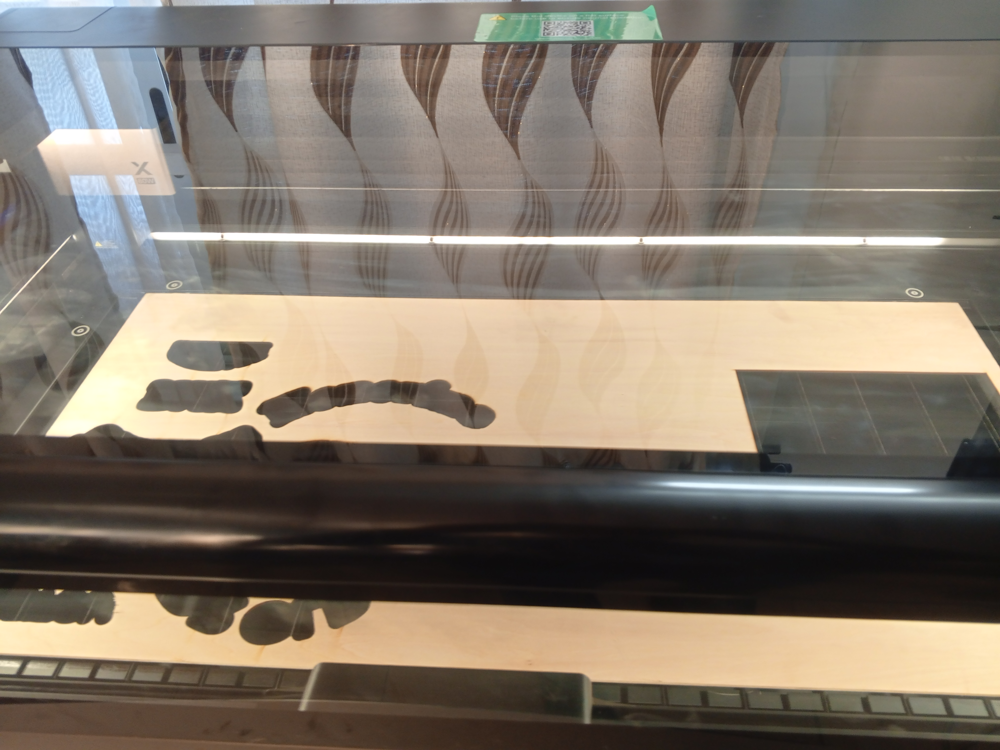

# Journal — mardi 26 août 2026 rédigé par : Merveil TODOKO

## Fait aujourd'hui

- Mise en place de 4 équipes composées plus ou moins de 25 personnes 
- Séance sur les projets à réaliser
- Séance avec les découpeuses laser
- Séance sur l'électronique
- Séance sur l'imprimante 3D
- Visite du personnel de l'organisation international avec le directeur de l'INFPP

## Appris

On a appris:
- Les types de découpeuses laser 
- L'anatomie d'une découpeuse laser
- Les grandes familles de laser industrielles
- Rappels sur les bases de l'électricité 
- Manipulation des appareils comme: le Multimètre pour mesurer la tension, les résistances..
- La présentation des types d'imprimantes 3D
- La fabrication additive
- les grandes familles de la technologies

## Raté, puis corrigé

-  La mesure de la résistance avec le multimètre mais corrigé avec l'aide d'un encadreur

## Décidé

Atteindre les objectifs attendus sur les projets à réaliser

## À faire demain

- On parlera des cahiers de charge
- On aura la présentation des projets.