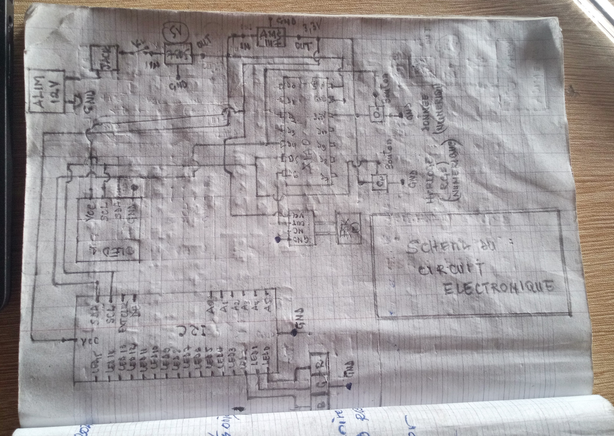

# Journal du Vendredi, le 11 Septembre 2026 (rédigé par Merveil TODOKO)

## Fait aujourd'hui

- Mise en place 
- Information sur le programme du jour :  
> **Avancement du Projet P 150 : Groupe 15**  
> *1-Schéma du Circuit électronique*  
> *2-Remodélisation du tiroir et de l'armoire*  

## Appris

- **1-Schéma du Circuit électronique**

> *-Les composants doivent être bien connecté pour éviter les court-circuits.*

> *-Exemple du cicuit en vesion papier:*

- **2-Remodélisation du tiroir et de l'armoire**  
> *-Dimension de l'Armoire et du Tiroir*  
> *-Modelisaton du Tiroir et Armoire sur le logiciel Fusion 360*  
> *-Impression du Tiroir et Armoire sur Imprimante 3D*  

## Raté, puis corrigé
- Circuit non correcte, Car les composants ne sont pas bien connecté 

- Erreur d'impression des fichiers donc impression inachevée:

## Décidé
- Prévoir un emplacement de la LED et FSR sur chaque casier et une espace sous chaque casier pour faire passé les fils de connexions.
- Le Boîtier doit comperter les éléments tels que: l'écran; la Battérie; le Module I2C et le PCB intégrant les autres composants à l'exception des FSR402 et les LED.

## À faire demain
- Impression du modèle de csier conçu sur l'imprimante 3D
- Modélisation du Boîtier 
- Ecrire un code pour tester l'écran OLED, le XIAO ESP32 la LED et d'autres composants 