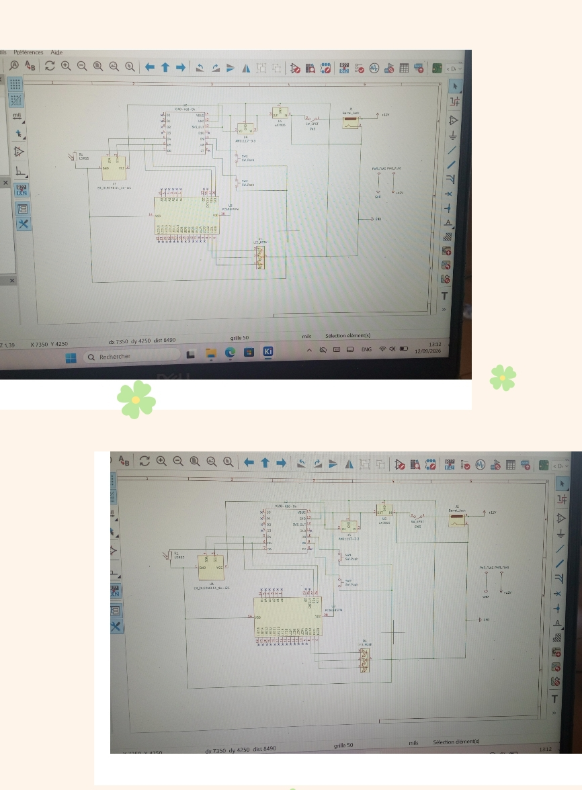

# Journal du Vendredi, le 12 Septembre 2026 (rédigé par  Merveil TODOKO)

## Fait aujourd'hui

- Mise en place 
- Information sur le programme du jour :  
> **Avancement du Projet P 150 : Groupe 15**  
> *1- Réalisation du cicuit en PCB sur Kicad*  
> *2- Remodélisation du tiroir et de l'armoire sur Fusion 360*  
> *3- Simulation du circuit et Test des composants sur Breadboard SK10*

## Appris

### 1- Réalisation du cicuit en PCB sur Kicad
> *Schéma du circuit électronique sur Kicad:*

### 2- Remodélisation du tiroir et de l'armoire sur Fusion 360
> *-Tiroi et Armoire sont donc conforme.*

> *-Créer un emplacement pour la LED RGB au niveau du casier.*

### 3- Simulation du circuit et Test des composants sur Breadboard SK10*
> *Réaliser le circurt électronique de quelques composants afin de Tester leur fonctionnement.*

> *Ecrire un code sur le logiciel Thonny pour allumer la LED RGB et afficher sur l'écran OLED la contenance d'un casier.*

## Raté, puis corrigé

- Difficulté à relier le Régulateur LM7805 au Bornier Jack et l'Alimentation.
- Difficulté à créer un emplacement pour la LED RGB sur l'Armoire.

## Décidé

- Finaliser la modélisation du Tiroir et Armoire.
- Chercher un Programme à écrire sur le logiciel Thonny pour code le XIAO ESP32.

## À faire demain

- Test Armoire + Tiroir + Composants électroniques.
- Programme d'affichage dans Thonny.
- Prototypage sur le Breadboard SK 10.