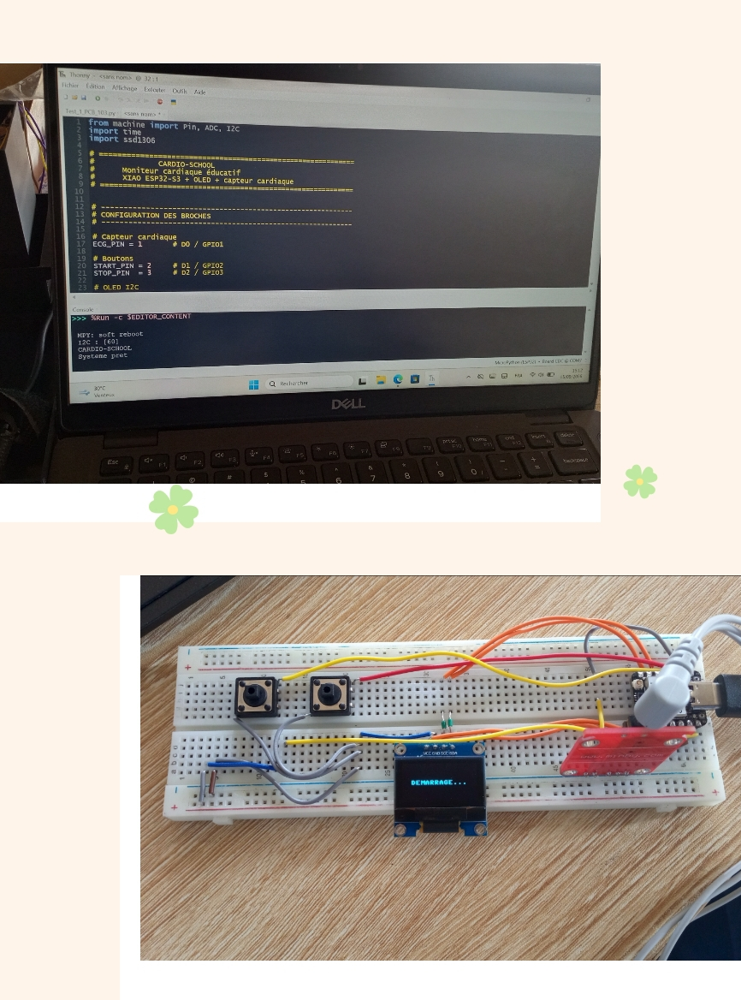
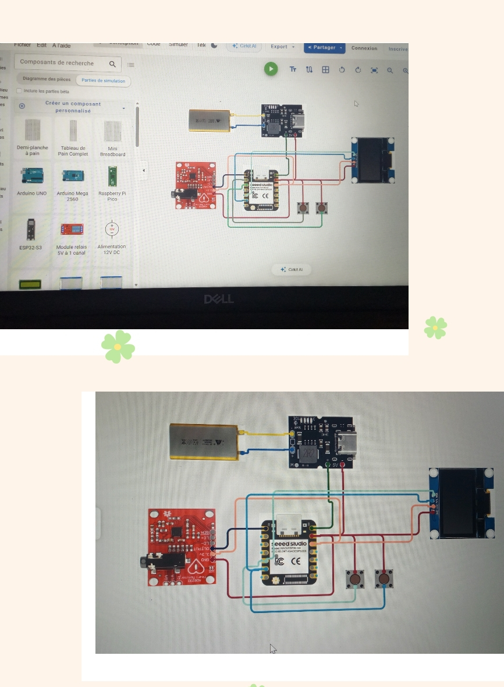

# Journal du Mardi, le 15 Septembre 2026 (rédigé par: Merveil TODOKO)

## Fait aujourd'hui

- Mise en place.
- Briefing du Projet précédent.
- Choix du nouveau Projet.

## Appris

### 1- Briefing du Projet P 150

#### 1.1- Nos réalisation et Nos échecs 
- Molélisation et Impression de notre casier après plusieurs échecs. 
- Simulation et Programme d'affichage avec le MicroPhyton dans Thonny pour tester les composants disponible

#### 1.2- Contexte
Le projet initial n'ayant pas pu être poursuivi en raison du manque de certains composants essentiels, nous avons décidé de réorienter notre travail vers un nouveau projet réalisable avec les ressources disponibles.

### 2- Choix du nouveau Projet

#### 2.1- Contexte
Le nouveau projet retenu est **SCHOOL - CARDIO : Système intelligent de mesure et de suivi de fréquence cardiaque en milieu scolaire**.

#### 2.2- Présentation
CARDIO-SCHOOL est un projet pédagogique qui explore l'utilisation de l'électronique, de la programmation et des systèmes embarqués dans le domaine de la santé scolaire.

Le prototype est basé sur un **XIAO ESP32-S3**, un écran OLED, deux boutons poussoirs et un module ECG **AD8232**.

Dans la première phase, un **signal ECG simulé par logiciel** sera utilisé afin de tester l'interface et la logique du système avant l'intégration d'un signal réel provenant de l'AD8232.

> **Remarque :** ce prototype est destiné à l'apprentissage et à la démonstration technologique. Il ne constitue pas un dispositif médical de diagnostic.

#### 2.3- Objectifs

- Utiliser le XIAO ESP32-S3.
- Commander un écran OLED SSD1306.
- Intégrer les boutons START et STOP.
- Générer un signal ECG simulé.
- Afficher graphiquement l'ECG sur l'OLED.
- Simuler un BPM variable entre **60 et 100 BPM**.
- Programmer le système en MicroPython dans Thonny.

- Tester le montage dans Cirkit Designer.

- Préparer le passage de la simulation au prototype réel.

#### 2.4- Matériel

- XIAO ESP32-S3
- Module ECG AD8232
- OLED 0,96" SSD1306 I²C
- Deux boutons poussoirs
- Batterie Li-ion 3,7 V
- Module de charge et d'élévation de tension
- Fils de connexion
- Breadboard pour le prototype physique

#### 2.5- Brochage retenu

| Composant | Connexion |
|---|---|
| AD8232 OUT | GPIO1 / D0 |
| AD8232 VCC | 3V3 |
| AD8232 GND | GND |
| OLED SDA | GPIO5 / D4 |
| OLED SCL | GPIO6 / D5 |
| OLED VCC | 3V3 |
| OLED GND | GND |
| START | GPIO4 / D3 |
| STOP | GPIO3 / D2 |

Les boutons utilisent les résistances **pull-up internes** du microcontrôleur.

## Raté, puis corrigé

- Abandon du Projet **P 150** par manque de certains composants tels que le Capteur FSR402 et le Module I2C PCA9685.
- La simulation du nouveau Projet étant difficle à réaliser sur Breadboard SK10 car le module ECG AD8232 voulu ne correspond pas à celui utiliser dans Cirkit Designer.
- Difficulté à organiser les Broches ; les I2C devaient être réservées à l'OLED.

## Décidé
- Comment concevoir un dispositif électronique accessible, portable et pédagogique permettant de mesurer la fréquence cardique des élèves avant, pendant et après une activité physique, tout en fournissant aux professionnels de l'établissement un outil simple d'observation et de suivi ? 

- Décision de ramener notre nouveau Projet à **Une Montre ECG** permettant de calculer **la fréquence cardiaque en battements par minute (BPM)** par manque de conformité 

## À faire demain
- Compiler le programme dans Cirkit Designer.
- Lancer la simulation.
- Vérifier l'OLED.
- Tester START.
- Tester STOP.
- Vérifier le tracé ECG.
- Vérifier la variation 60–100 BPM.
- Corriger les erreurs éventuelles.
- Passer progressivement à l'AD8232 réel.