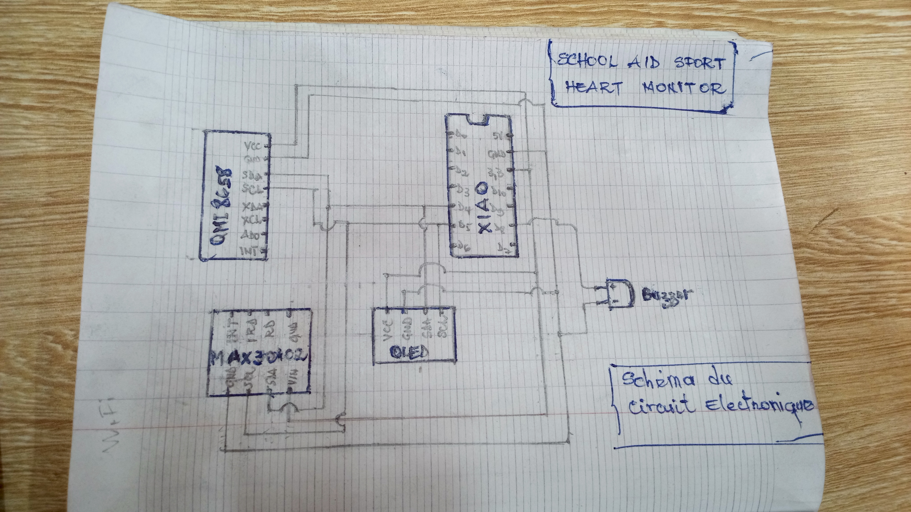
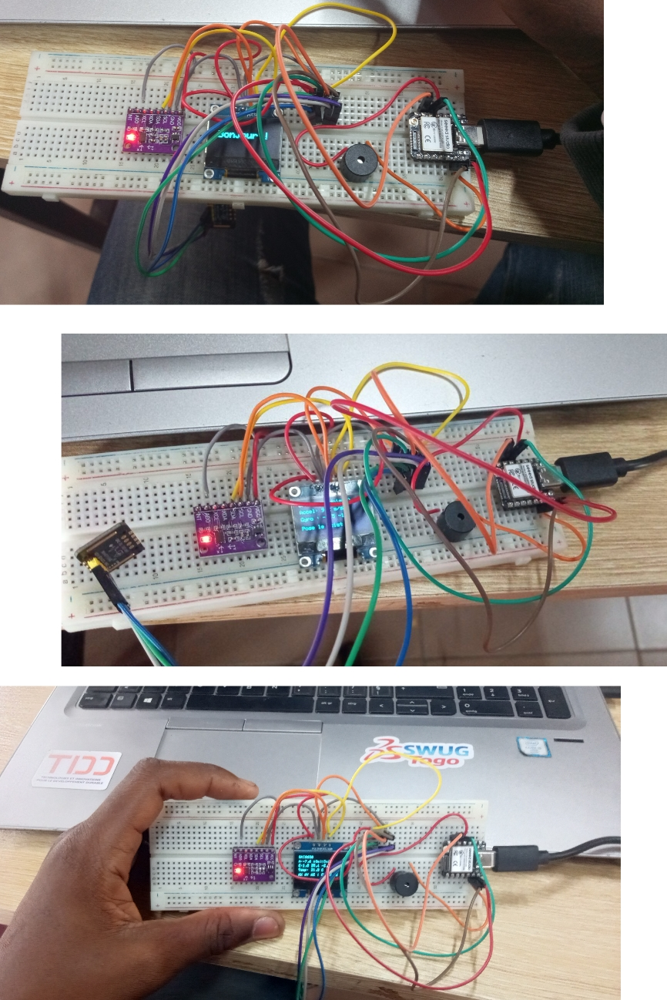
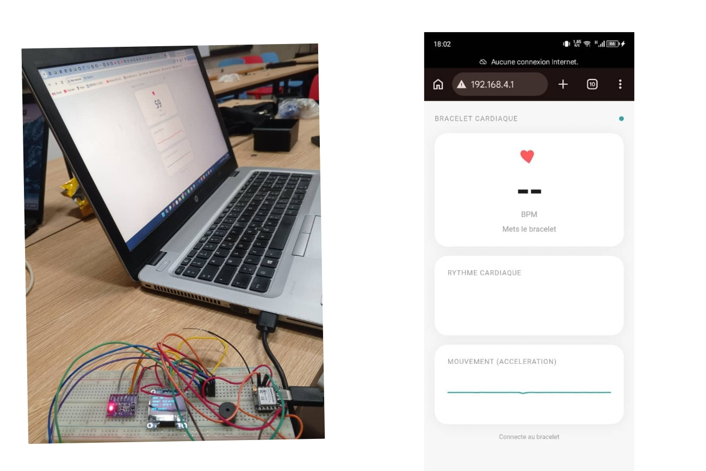
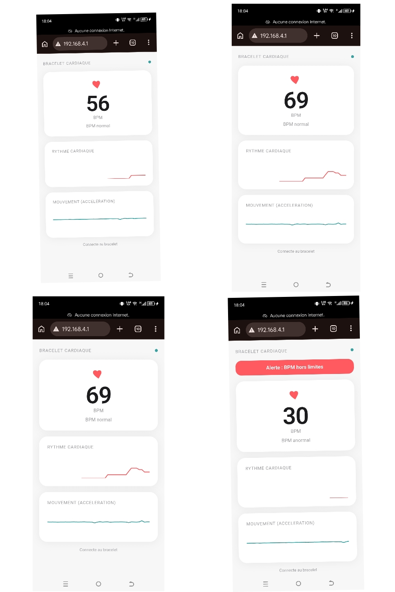
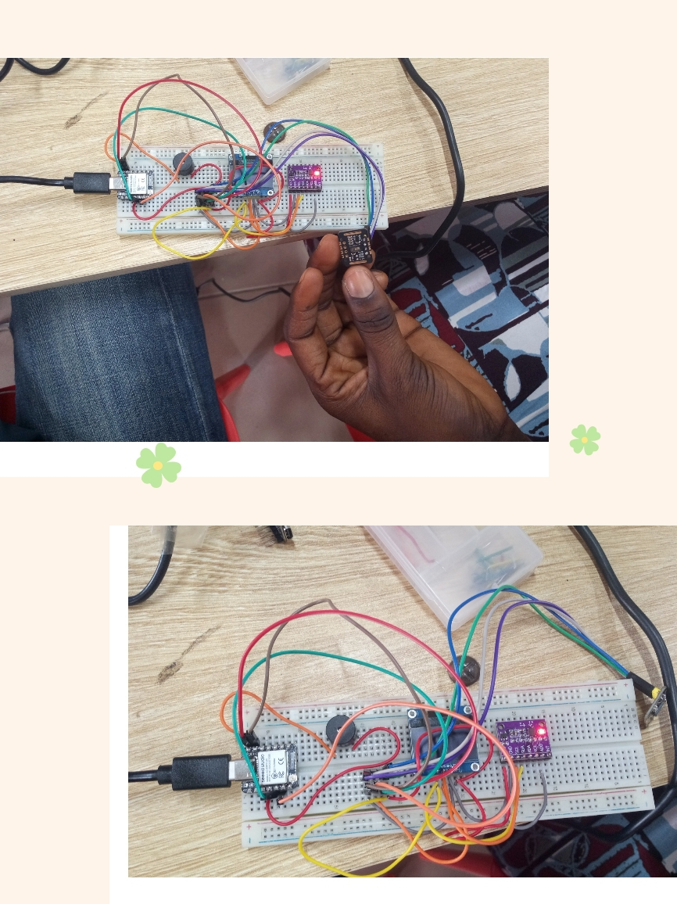

# Journal du Mercredi, le 16 Septembre 2026 (rédigé par: Merveil TODOKO)

## Fait aujourd'hui

- Le Programme du jour:
- Briefing du sur le nouveau Projet .
- Avancement sur le nouveau Projet .

## Appris

### 1- Briefieng

- Evolution du projet nommé : **SCHOOL AID SPORT HEART MONITOR (SASHM)** vers une forme de montre connectée éducative centrée sur la mesure de la fréquence cardiaque.

- Le projet est destiné à un usage pédagogique et sportif et ne constitue pas un dispositif médical de diagnostic.

### 2- Avancement du Projet : SASHM 
#### 2.1- Objectifs 
- Mesurer la fréquence cardiaque grâce au capteur  optique **MAX30102**
- Afficher **le rythme cardiaque (BPM)** en temps réel sur l'écran **OLED SSD1306.** 
- **Détecter les mouvements et l'activité Physique** à l'aide du **QMI8658.**
- **Analyser les données des capteurs** avec le **XIAO ESP32-S3**
- **Programmer le système en MicroPython** à l'aide de Thonny

### 2.2- Architecture retenue

**Les composants retenus sont :**

- **XIAO ESP32-S3** : unité centrale de traitement.
- **MAX30102 MH-ET LIVE** : capteur optique de fréquence cardiaque.
- **OLED SSD1306 0,96" I²C** : affichage du BPM.
- **QMI8658** : capteur de mouvement 6 axes.
- **Batterie Li-Po 3,7 V** : alimentation autonome.
- **Module de charge USB-C avec protection** : recharge de la batterie.
- **Buzzer optionnel** : alerte sonore éventuelle.

**Éléments supprimés de la version actuelle :**

- Boutons poussoirs.
- AD8232.
- Régulateur AMS1117-3.3.
---
#### 2.3- Câblage principal

Les trois modules I²C utilisent le même bus.

| Fonction | XIAO ESP32-S3 |
|---|---|
| SDA | D4 / GPIO5 |
| SCL | D5 / GPIO6 |
| Alimentation modules | 3V3 |
| Masse | GND |

### MAX30102

| Broche | Connexion |
|---|---|
| VIN | 3V3 |
| GND | GND |
| SDA | D4 / GPIO5 |
| SCL | D5 / GPIO6 |
| INT | Non connecté |

### OLED SSD1306 0,96"

| Broche | Connexion |
|---|---|
| VCC | 3V3 |
| GND | GND |
| SDA | D4 / GPIO5 |
| SCL | D5 / GPIO6 |

### QMI8658

| Broche | Connexion |
|---|---|
| VCC | 3V3 |
| GND | GND |
| SCL | D5 / GPIO6 |
| SDA | D4 / GPIO5 |
| XDA | Non connecté |
| XCL | Non connecté |
| AD0 | Non connecté |
| INT | Non connecté |

---
- Schéma du Montage électrique:

#### 2.4-Montage et Simulation
- **Passage du montage sur breadboard au câblage direct :**

Une première validation du circuit a été réalisée sur **Breadboard SK10**.

- **Interface d'une Application :**  
> -*Créer un site web permettant de suivre le rythme cardiaque (BPM) une fois que l'on porte le bracelet Cardiaque (la Montre Connectée).*

> -*l'adresse du site est directement généré par Wifi du microcontrôleur XIAO ESP32 " Wifi Cardio-Bra; Une fois connectée à ce Wifi, il nous conduit vers l'interface de l'application suivant l'adresse : http://192.168.4.1*

> *-Quelques tests pratiques en images*

## Raté, puis corrigé

- Le Premier test d'affichage des informations est erroné grâce à un mauvais code écrit.

## Décidé

- Pour la future montre, le choix est maintenant de réaliser le montage **sans breadboard**, avec un câblage direct et compact entre les modules.
- Créer un circuit intégré en PCB, double face

## À faire demain
- Concevoir un boîtier pour faire intégré **la Montre** 
- Créer le circuit intégré en PCB.