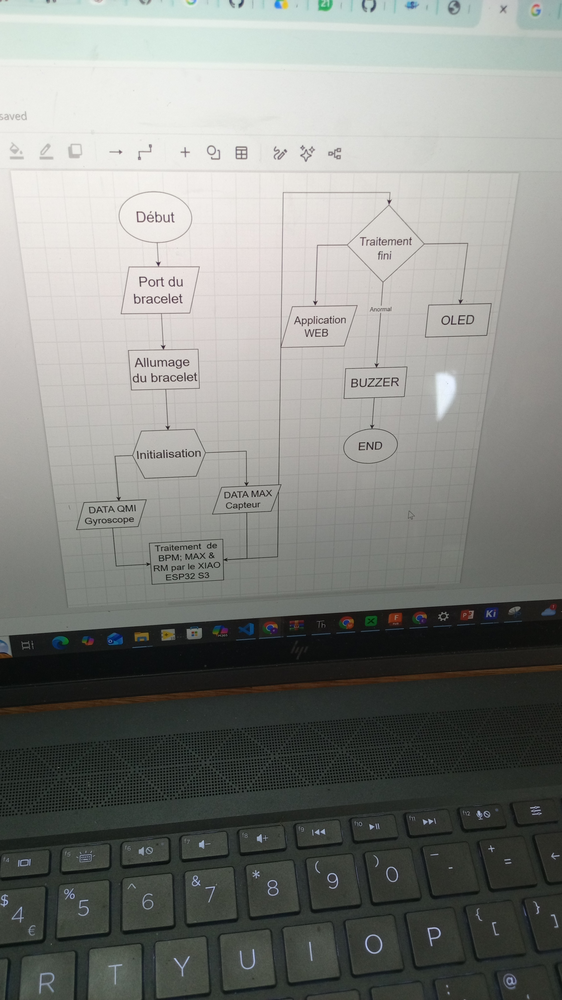
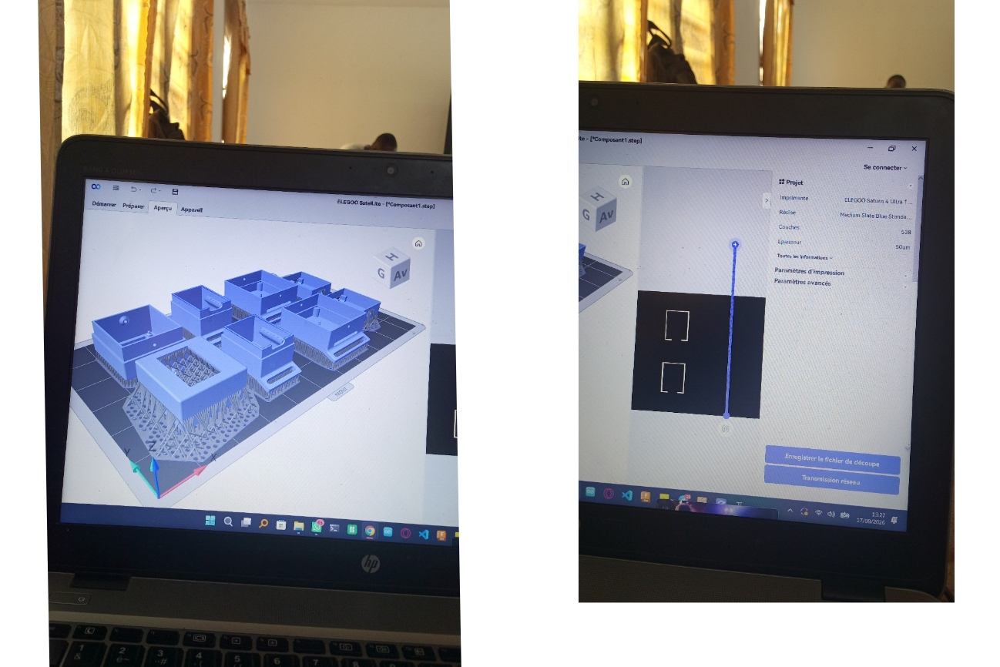
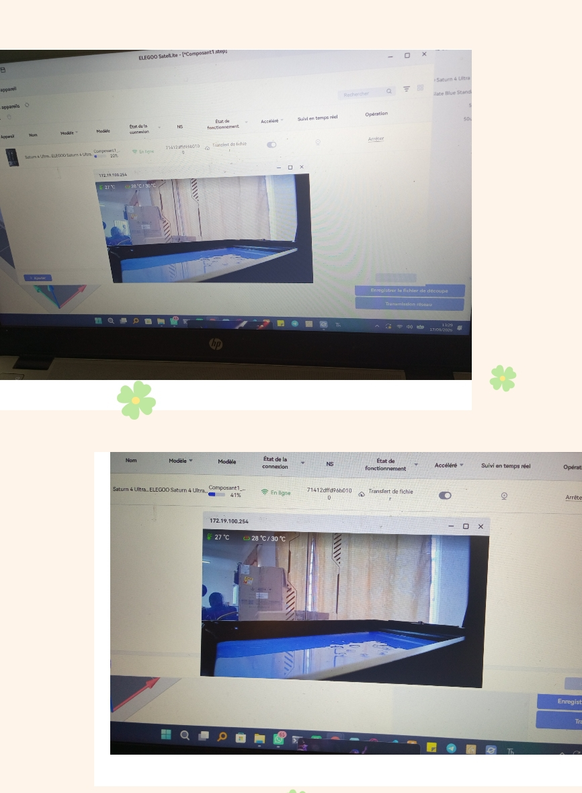

# Journal du Jeudi, le 17 Septembre 2026 (rédigé par: Merveil TODOKO)

## Fait aujourd'hui

- Le Programme du jour:
- Briefing du sur le Projet : SASHM.
- Avancement sur le Projet: SASHM .

## Appris

### 1- Briefing:

- Evolution de notre projet : **SASHM** pour avoir un interface Web-Application pour suivre le rythme cardique issue de la montre connectée.

- Concevoir un boîtier pour faire intégré la montre uis créer un circuit intégré réduit en PCB double face .

- Elaborer un organigramme du PowerPoint de notre Projet

### 2- Avancement du projet:

- **Organigramme du PowerPoint de notre :**

- **Conception du Boîtier de la Montre :**

- **Impression du Boîtier pièce par pièce à la Résine :**

> *Remarque:* **Stéréo Litographie (SLA)** solidifie la résine avec RUV

## Raté, puis corrigé
- Néant

## Décidé
- Plan du projet pour la Présentation de notre projet.
- le nom du projet est changé. Donc le nouveau nom est :  **SCHOOL SPORT HEART MONITOR**

## À faire demain
- Présentation du Projet : **SCHOOL SPORT HEART MONITOR**