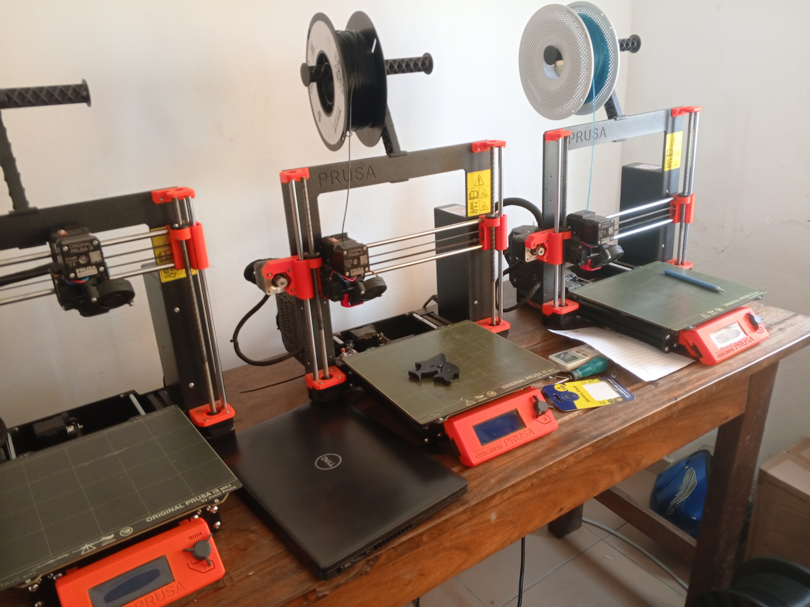

# Journal du mardi 25 août 2026 rédigé par : Merveil TODOKO

## Fait aujourd'hui

- Manipulation de VSCode 
- La création de 25 groupes composés de 4 personnes pour la réalisation des projets 
- Fablab, maker space, atelier
- L'inventaire de référence dans les Fablabs
- Les réseaux de Fablab
- Les six rubriques de la Fab Charter 

## Appris

On a appris
- Manipulation de VSCode avec: La création de dépôt, comment faire un commit
- L'hisoriue des Fablabs et la différence entre Fablab, maker space et atelier
- L'inventaire de référence dans les Fablabs: Découpeuse laser, Fraiseuse CNC, Fraiseuse de précision, Découpoe vinyle, impression 3D,Poste électronique 

## Raté, puis corrigé

- Problème de connexion au début de la séance mais une solution a été apportée grâce à l'internet payé pour des fabmanagers
- Juste une partie des fabmanagers a reçu le lien de github par mail à cause de la limitation d'envoi par mail journalier 

## Décidé

Avoir la maîtrise des six rubriques de la Fab Charter

## À faire demain

- Demain des groupes seront formés pour les différents modules à suivre
- Demain on commence la visite des ateliers d'imprimante 3D, de la découpeuse laser et autres
- On parlera des cahiers de charge