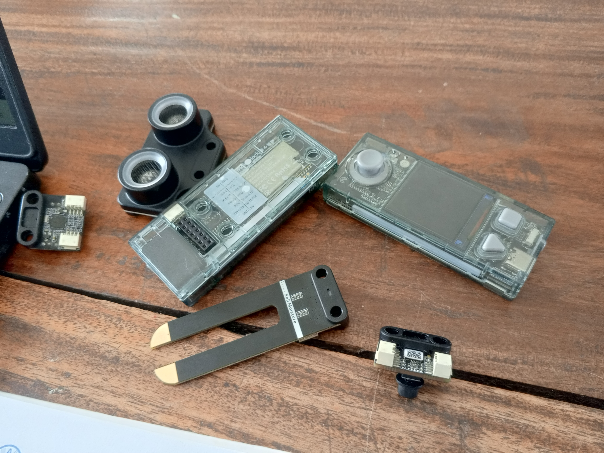

# Journal — mardi 27 août 2026 rédigé par : Merveil TODOKO

## Fait aujourd'hui

- Mise en place de 4 équipes composées plus ou moins de 25 personnes 
- Séance sur les projets à réaliser
- Séance avec les découpeuses laser
- Séance sur l'électronique
- Séance sur l'imprimante 3D
- Visite du personnel de l'organisation international avec le directeur de l'INFPP

## Appris

On a appris:
- A utiliser le logiciel xTool Studio pour imprimer nos cartes à l'aide de la découpeuse laser
- Les différents types de capteurs: capteurs de lumière, de son, de présence, de température 
- A utiliser mBlock pour coder 
- A manipuler Bambu Studio 

## Raté, puis corrigé

-  J'ai mal programmé l'affichage des led pour qu'il puisse s'afficher avec une couleur à la fois mais j'ai pu trouver une solution gràce au formateur et à un assisant

## Décidé

Atteindre les objectifs attendus sur les projets à réaliser

## À faire demain

- On parlera des cahiers de charge
- On aura la présentation des projets.