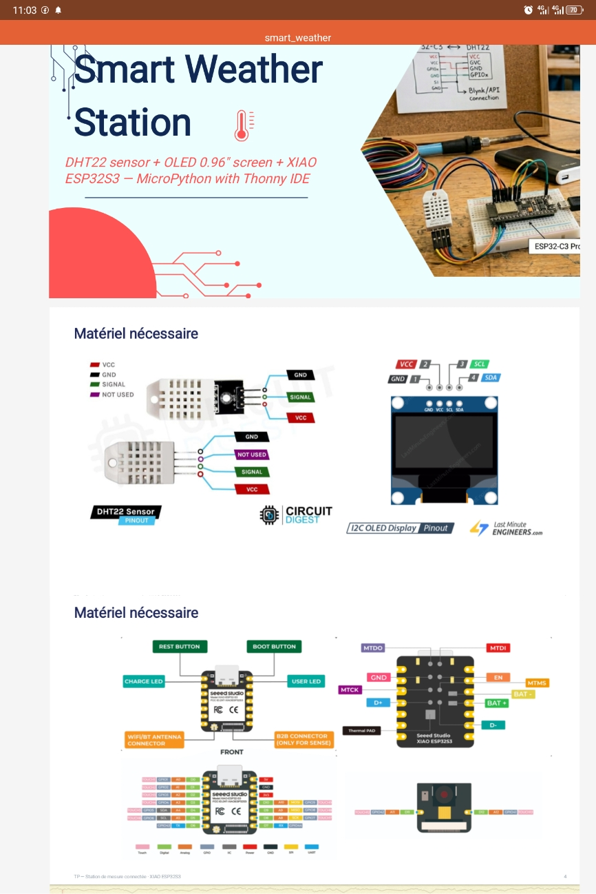
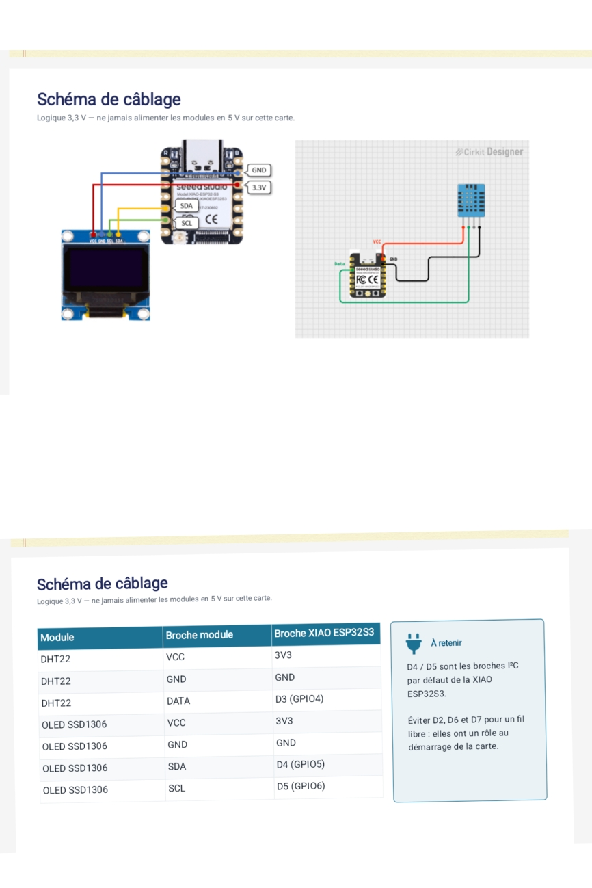
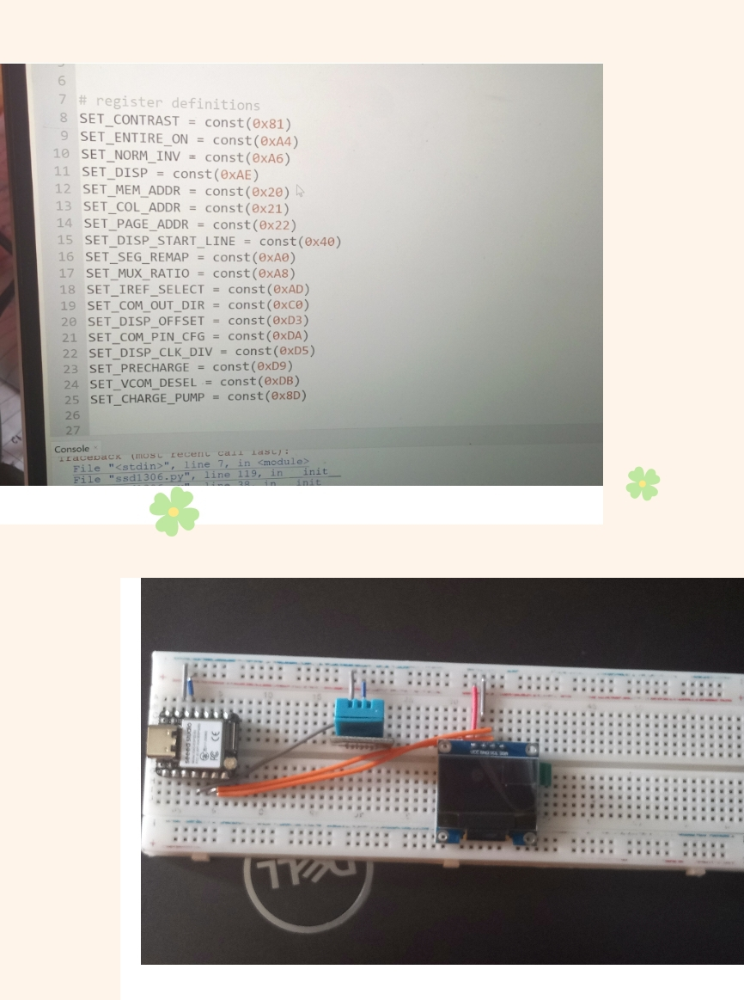

# Journal du Samedi, le 05 Septembre 2026 (rédigé par Merveil TODOKO)

## Fait aujourd'hui

- Mise en place 
- Information sur le programme du jour.
> **SMART WEATHER STATION :**

> **-Contexte**   
> **-Objectifs de la séance**    
> **-Matériel nécessaire**    
> **-Comparaison des cartes**    
> **-Schéma de câblage**    
> **-Installation et configuration de Thonny**    
> **-Installation des bibliothèques  :**  "Premier Programme de test"  
> **-Critères de Réussite**

## Appris
- **Fonctionnement :**
> Le capteur de température **DTH22** reçoît l'information et l'envoie à l'écran **OLED**.

> Le microcontrôleur **XIAO ESP32-S3** envoie le code programmé à partir de MicroPython **Thonny**

- **Schéma de câblage :**

- **Du Circuit à La Programmation :** correct

## Raté, puis corrigé
- **Compilation erronné** : problême lié à la connexion  de fils sur la Breadboard.

## Décidé
- Néant

## À faire demain
- Cours d'initiation aux PCB