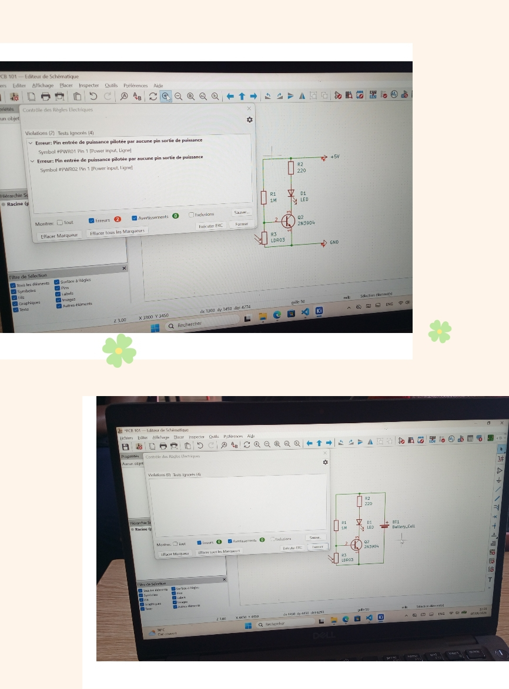
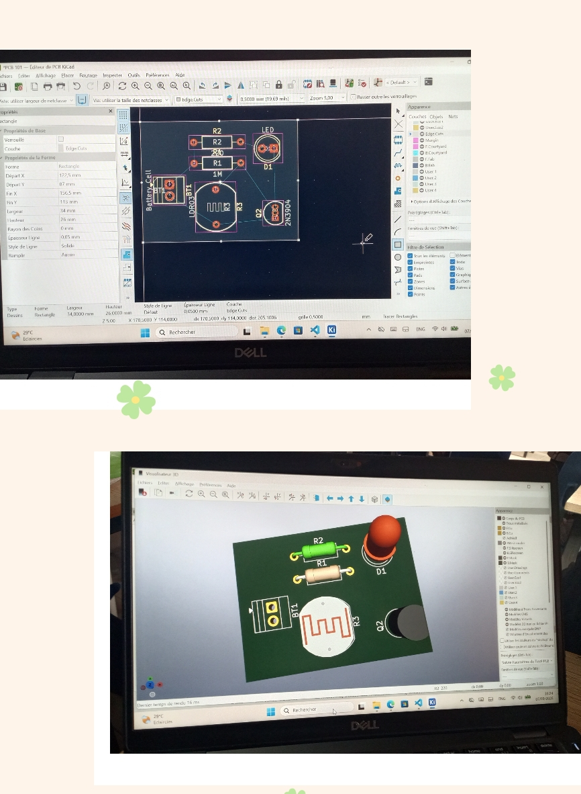
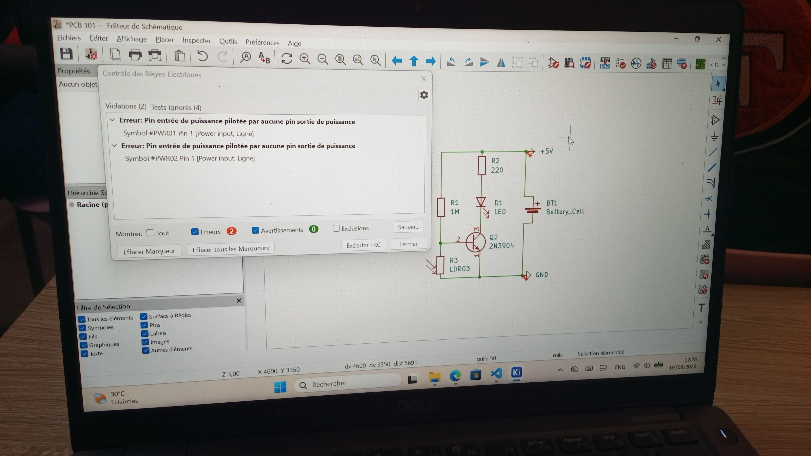
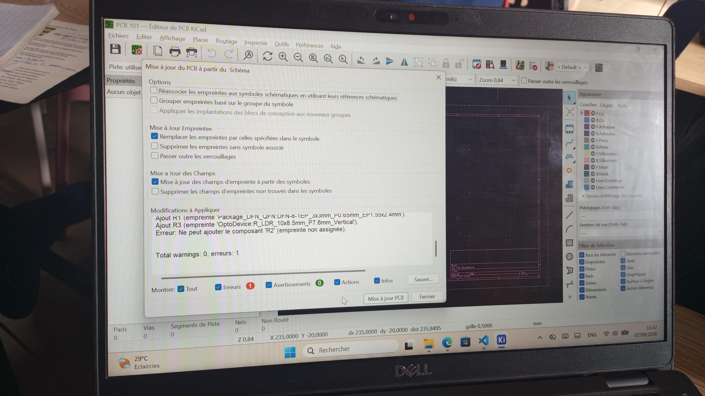

# Journal du Lundi, le 07 Septembre 2026 (rédigé par: Merveil TODOKO)

## Fait aujourd'hui

- Mise en place 
- Information sur le programme du jour.
> *1-Questions-Réponses*  
> *2-Cours d'initiation aux PCB*

## Appris
### 1- Questions-Réponses
- Receuil des informations et des questions sur le déroulement de la formation suivi des réponses. 
- Suggestion pour les prochaines étapes.

### 2- Cours d'Initiation aux PCB
- **Le PCB est le coeur d'un circuit électronique**
- **Pourquoi passer du prototype au PCB ?** 
> "Breadboard → PCB"
- Anatomie du PCB:
> Substrat → Cuivre → Solder mask → Silkscreen → Pads → Vias → Trou de fixation

- **De l'idée au Schéma** 
> Logiciels Courants : Kicad → EasyEDA → Album Designer

- **Cas Pratiques :**
> *1-Nouveau projet* → Kicad → Choix du dossier → Nommer le fichier →  double-cliquer sur le logo du fichier.  
> Cliquer ensuite sur l'onglette fichier →  Ajustable-Page →  Titrer le projet →  Schéma du montage électrique.

> *2-Contrôle des règles: cocher  Erreur et Avertissement pui OK*

> *3- Assigner Empreintes :*  

> -Sélectionner R1 et R2 →  sélectionner Resistor THT(librairie d'empreinte) →  Choisir le 20 → Affichier →  Empreinte:Resistor THT →  visualisateur 3D  

>  -Sélectionner D1 LED →  sélectionner LED THT(librairie d'empreinte) →  Choisir le 33 → Affichier →  Empreinte:LED THT →  visualisateur 3D  

>  -Sélectionner Q2 "Transistor" →  sélectionner Package TO.SOT.THT(librairie d'empreinte) →  Choisir le 105 → Affichier →  Empreinte: Package TO.SOT.THT →  visualisateur 3D  

> -Sélectionner BT1 "Battery" →  sélectionner TerminalBlock(librairie d'empreinte) →  Choisir le 24 → Affichier →  Empreinte:TerminalBlock →  visualisateur 3D  

## Raté, puis corrigé

- Contrôle des règles : Après avoir placé la batterie, il faut enlever le **+5V** et le **GND** 

- Sélectionne du câblage/ désignation de **R2** erroner puis corrigé; elle devait correspondre à celle de **R1**

## Décidé

- Néant

## À faire demain
PROJET