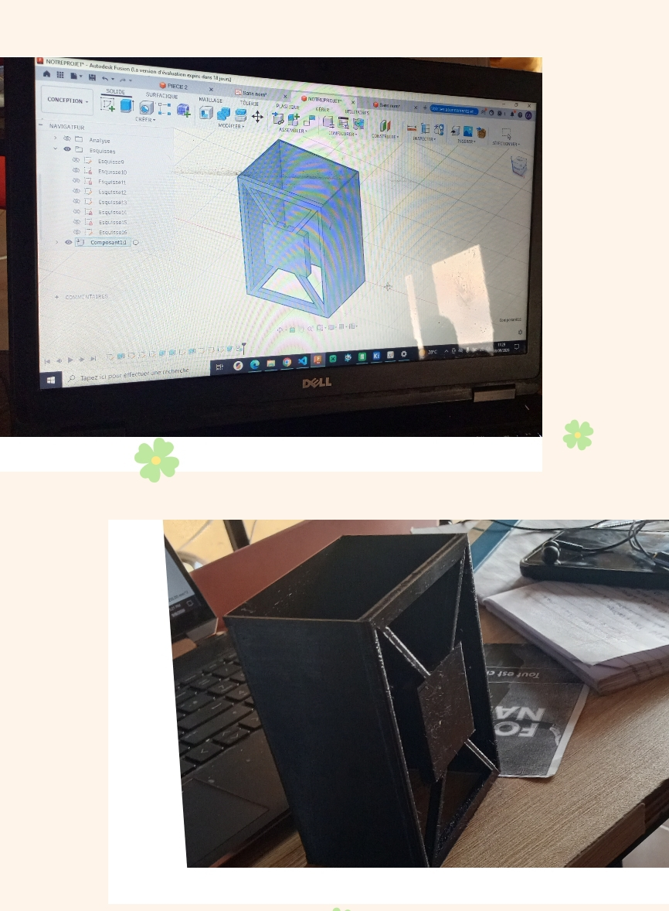

# Journal du Mardi, le 08 Septembre 2026 (rédigé par Merveil TODOKO)

## Fait aujourd'hui

- Mise en place 
- Information sur le programme du jour.
> *1-Consolidation du Projet **P 150***  
> *2-De la conception à la pièce usinée avec Fusion 360*

## Appris

### 1-Consolidation du Projet : P 150  

- **Dimensionnement**
> **-Les dimensions du berceau/tiroir :** en vu de profile (3x3)   → pour chaque tiroir  
> longueur ={ex→102mm; in→100mm}; largeur = {ex→83mm; in→81mm}; hauteur ={ex→50mm; in→48mm}   

> **-Les dimensions de l'armoire :**  en vu de face 2D (contenance de 9 berceaux/tiroirs)    → pour chaque armoire
> largeur = {ex→87mm; in→85} ; hauteur ={ex→62mm; in→55mm} ; longueur(extrusion){=120mm}

- **Prototypage**
> Un examplaire d'Armoire modélisé sur Fusion 360

### 2- De la conception à la pièce usinée avec Fusion 360

- **Présentation du Cours**
> *-La FAO = La Fabrication Assisté par l'Ordinateur*

- **Cas Pratiques**
> *-La Concepetion de la pièce*  
> *-La Fabrication de la pièce*

## Raté, puis corrigé
- Néant

## Décidé
- Néant

## À faire demain
- Fabricatiion des PCB de chaque composant du projet **P 150** dans Kicad 
- Réalisation du schéma électrique interconnecté de chaque composant